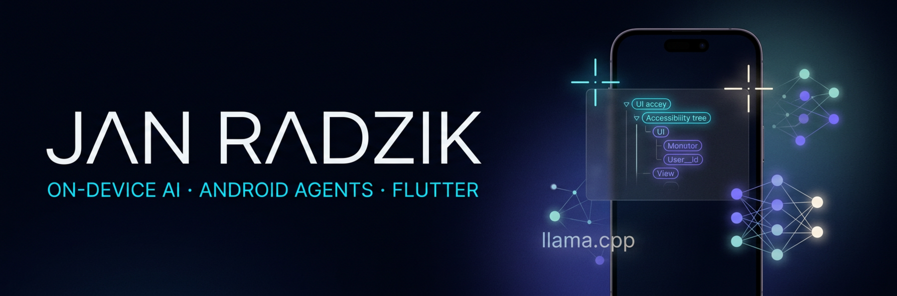
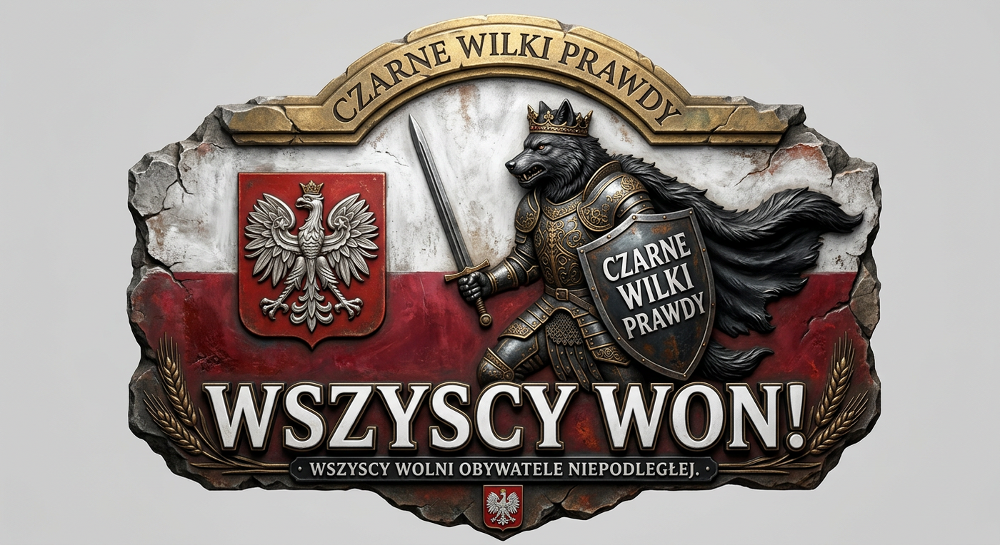
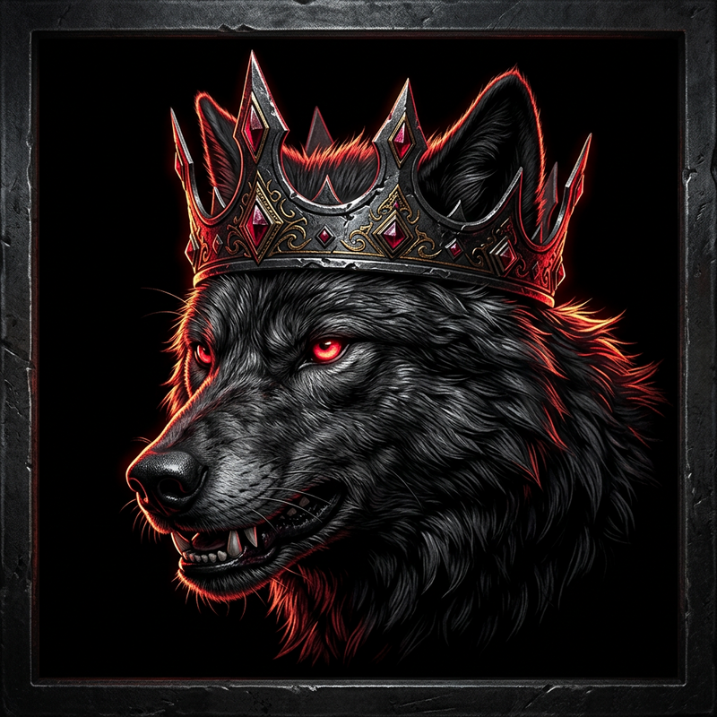
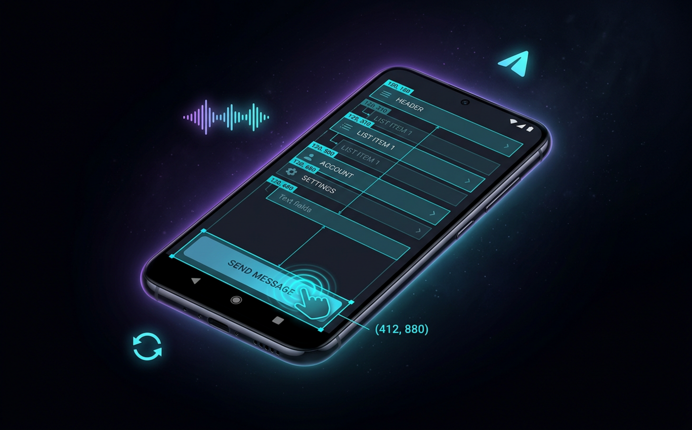
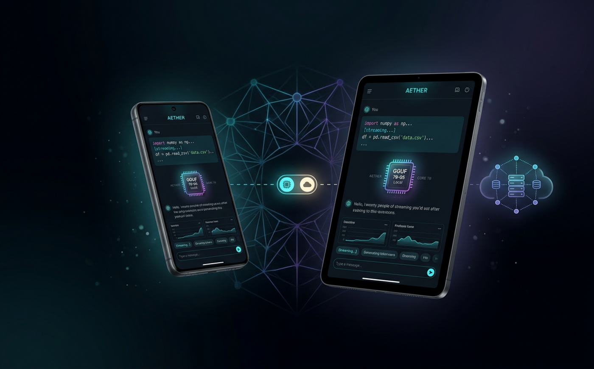

<p align="center">
  
</p>

<p align="center">
  
</p>

<h1 align="center">CZARNE WILKI PRAWDY WOJAN</h1>
<p align="center">
  <strong>WOJAN</strong> · Czarne Wilki Prawdy<br>
  <em>Wszyscy wolni obywatele niepodległej.</em>
</p>

<p align="center">
  
  
  
  
  
</p>

---

Jestem **Wojan**. Buduję prywatne systemy AI, które żyją na telefonie — czytają ekran, wykonują zadania i myślą lokalnie. Kod zostaje przy właścicielu urządzenia.

I design Flutter systems at the boundary of **native Android**, **accessibility**, and **on-device LLMs**. The question I keep returning to:

> Can a model finish a real multi-step task on *any* installed app — without screenshots-as-crutch, without leaking your screen to the cloud, and without a human holding the phone?

Dwa systemy odpowiadają z dwóch stron: jeden **działa** na UI, drugi **myśli** na urządzeniu.

<p align="center">
  
</p>

---

## Featured systems

<table>
  <tr>
    <td width="50%" valign="top">
      
      <h3>PrivateAgent</h3>
      <p><strong>Android automation agent.</strong> Natural language in. Real taps, scrolls, and text on any app out.</p>
      <p>
        <code>AccessibilityService</code> · coordinate geometry · DeepSeek / OpenRouter · Telegram · STT
      </p>
    </td>
    <td width="50%" valign="top">
      
      <h3>PrivateLM</h3>
      <p><strong>Cross-platform AI client.</strong> GGUF models run on-device (Vulkan / Metal). Cloud is a switch, not a dependency.</p>
      <p>
        <code>llama.cpp</code> · Hive · GetX · OpenAI / Claude / Gemini / Kimi · multimodal
      </p>
    </td>
  </tr>
</table>

---

## PrivateAgent — a closed loop, not a macro recorder

The agent does not replay scripts. It **sees the current frame**, decides one action, executes it natively, and looks again until the task is done.

```
 user ──► command          voice · text · Telegram
              │
              ▼
        capture UI tree    clickable / scrollable / editable + exact bounds
              │
              ▼
        AI next action     tap(x,y) · type · scroll · back · done
              │
              ▼
        native execute     AccessibilityService, not ADB, not root
              │
              └──────── observe result ─────────┐
                                                │
                         complete ◄─────────────┘
```

| Capability | Why it matters |
| --- | --- |
| **Screen reading** | Walks the Android UI tree and maps every interactive node to spatial coordinates. |
| **Coordinate taps** | Hits icons with no text label and controls that accessibility names never expose. |
| **Remote access** | Background Telegram poll — issue a task from another room, watch it finish. |
| **Voice** | Native speech-to-text for hands-free control. |
| **Free brain** | OpenRouter free models (`openai/gpt-oss-120b:free` and friends). No paid key required. |

**Runtime:** Android 8.0+ (API 26), universal APK for ARM64 / armeabi-v7a / x86_64. Release builds are checked against Android 15/16 **16 KB page-size** native alignment.

<details>
<summary><strong>Onboarding that actually survives sideloading</strong></summary>

<br>

Android will block accessibility for an APK that did not come from Play. That is an OS restriction, not an app bug. The client surfaces both shortcuts during first-run:

1. **Settings → Apps → PrivateAgent → ⋮ → Allow restricted settings**
2. Enable **PrivateAgent Screen Control** in Accessibility
3. In-app Settings → chip **OpenRouter** → paste key → set model

Telegram is a token from BotFather plus a toggle. The service keeps a background long-poll so commands arrive with the screen off.

</details>

---

## PrivateLM — local weights, cloud only when you ask

A production Flutter client that treats **on-device inference as the default** and normalizes four cloud shapes behind one interface.

```
 UI          ChatView · TaskView · ModelView · SettingsView
                 │
 Controllers     Chat · Task · Model · Settings · Home          (GetX)
                 │
 Services        InferenceService   CloudService   DownloadSvc
                 HiveService        DeviceInfoSvc  ExecutionSvc
```

**On the metal (Android / iOS)** the `llama_flutter_android` plugin wraps `llama.cpp`:

1. Probe **Vulkan** (Android) or **Metal** (iOS) and pick offload layers
2. Size the thread pool from the device tier — ultra / high / mid / low
3. Stream GGUF load progress so the UI never freezes
4. `generateChat()` with native templates: ChatML, Llama-3, Gemma, Phi
5. Fall back to a hand-built prompt if the native template fails

Idle cutoff at **5 s**, hard timeout at **180 s** — the chat stays responsive on a mid-range Snapdragon.

**In the cloud**, one `CloudService` speaks four dialects:

| Provider | Shape |
| --- | --- |
| OpenAI | `/v1/chat/completions` |
| Anthropic | Messages API, system as its own field |
| Google Gemini | `generateContent` + inline base64 images |
| Kimi (Moonshot) | OpenAI-compatible |

Keys live in **Hive**. They leave the device only toward the provider you picked. Chats, tasks, and settings never sync unless you choose cloud mode.

| Platform | Local GGUF | Cloud | Notes |
| --- | :---: | :---: | --- |
| Android | ✅ | ✅ | NEON + Vulkan, minSdk 28 |
| iOS / iPad | ✅ | ✅ | Metal. iPad is the RAM-honest target; iPhone is experimental |
| Web | — | ✅ | stubbed local engine, cloud today |

First launch reads device RAM and recommends context length and token caps. Multimodal works both ways: **Qwen2-VL** on-device, vision endpoints in the cloud. Image generation has been exercised on **Moto G71**, **OnePlus 10R**, **Pixel 6a**, **Poco F1**, and **Galaxy S23**.

<details>
<summary><strong>Build notes I actually use</strong></summary>

<br>

```bash
# Android
flutter pub get
cp android/key.properties.example android/key.properties   # never rotate this key
flutter build apk --release --split-per-abi

# iOS
flutter pub get && (cd ios && pod install) && flutter build ios

# Web
flutter pub get && flutter build web --release
```

Prerequisites: Flutter ≥ 3.3, JDK 17, Android SDK 26+, NDK. Per-ABI APKs must bump `pubspec.yaml` build number on every GitHub release — Play and sideload both refuse a downgrade of `(versionCode, signing cert)`.

</details>

---

## Stack I reach for

<p align="center">
  
  
  
  
  
  
  
  
  
  
  
  
</p>

**UI & state** — Flutter 3, GetX, platform channels into Accessibility and speech.  
**Persistence** — Hive for chats, tasks, settings, API keys.  
**Inference** — `llama.cpp` via a custom Flutter plugin; Vulkan offload on ARM64; Metal on iPad.  
**Cloud** — Dio / `package:http`, provider-normalized.  
**Background** — `flutter_background_service`, local notifications, FCM.  
**Device intelligence** — RAM / GPU tiering so a Poco F1 and an S23 do not get the same context window.

Conditional compilation keeps the UI honest:

```
Android  →  inference_android.dart     full llama.cpp
iOS      →  inference_android.dart     Metal GPU path
Web      →  inference_stub.dart        cloud-only

InferenceService.supportsLocalInference
        hides the local-model chrome on stubs
```

---

## What I care about in this space

- **Geometry over pixels.** A UI tree with bounds beats a screenshot for action selection — cheaper tokens, fewer hallucinated buttons.
- **Local by default.** A GGUF on flash plus Vulkan is a product. An API key is an upgrade path.
- **Sideload is a first-class install.** Restricted-settings, 16 KB ELF alignment, split-per-ABI, and a signing key you never rotate.
- **Timeouts are UX.** Five quiet seconds and a 180 s hard stop beat a frozen generate on a warm SoC.

---

<p align="center">
  
  
</p>

<p align="center">
  <sub>WOJAN · Czarne Wilki Prawdy · Flutter · Android · on-device LLM</sub>
</p>
